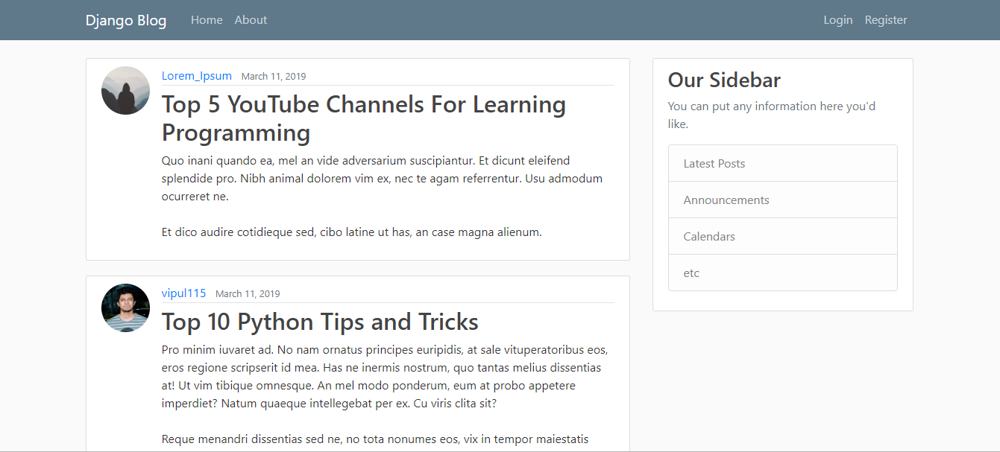
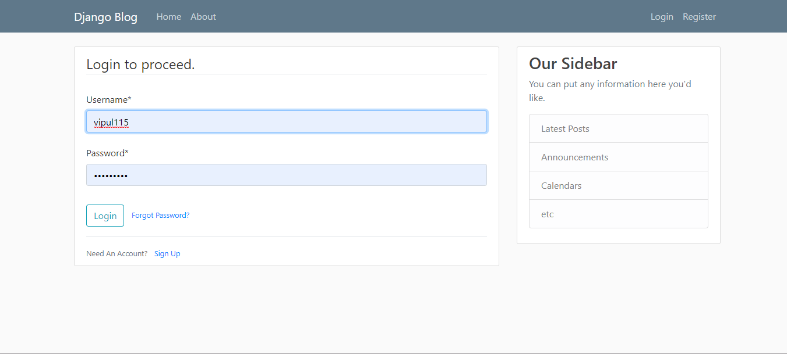
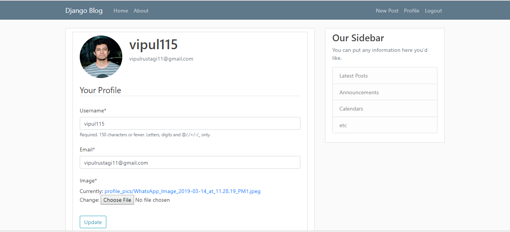
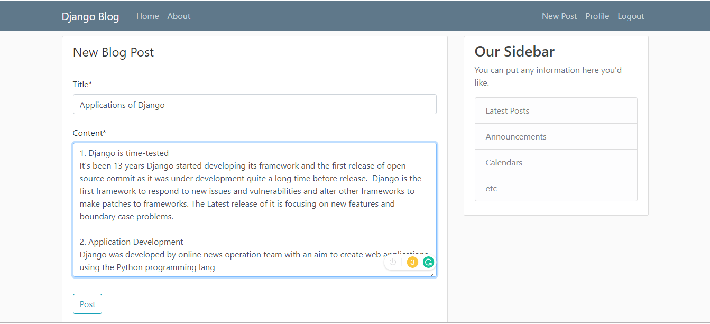
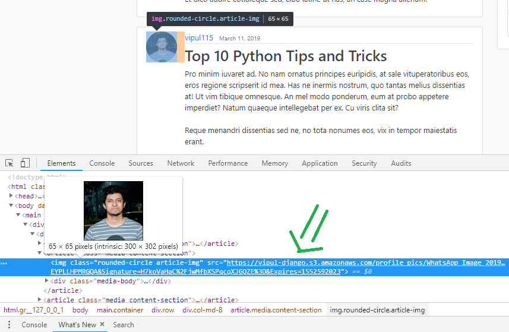

# Web Blogging Application
> A Web application for writing online blogs. This project is focused on developing and portraying backend development skills rather than frontend.




## Setup

The first thing to do is to clone the repository:

```sh
$ git clone https://github.com/Vipul115/Web-Blogging-Application.git
$ cd Web-Blogging-Application
```

Create a virtual environment to install dependencies in and activate it:

```sh
$ virtualenv venv
```

  For Windows:
```sh
$ venv\Scripts\activate
```
  For Linux or Mac:
```sh
$ source venv/bin/activate
```

Then install the dependencies after navigating to the project directory:

```sh
(venv)$ pip install -r requirements.txt
```
Note the `(venv)` in front of the prompt. This indicates that this terminal
session operates in a virtual environment set up by `virtualenv`.

Once `pip` has finished downloading the dependencies:
```sh
(venv)$ cd <project directory>
(venv)$ python manage.py runserver
```
And navigate to `http://127.0.0.1:8000/`.

### REQUIRED ENVIRONMENT VARIABLES:

- EMAIL_HOST_USER : User's email
- EMAIL_HOST_PASSWORD : User's Password
- AWS_SECRET_ACCESS_KEY : AWS User Secret Key
- AWS_ACCESS_KEY_ID : AWS User Key ID
- AWS_STORAGE_BUCKET_NAME : AWS S3 bucket name

## Screenshots

##### Login Page

##### Register a new user

##### User's Profile Page

##### Submit a New Blog

##### Integration with AWS S3


## Meta

Vipul Rustagi – [LinkedIn](https://www.linkedin.com/in/vipul-rustagi-331290150/) – vipulrustagi11@gmail.com

[My GITHUB](https://github.com/Vipul115/)


